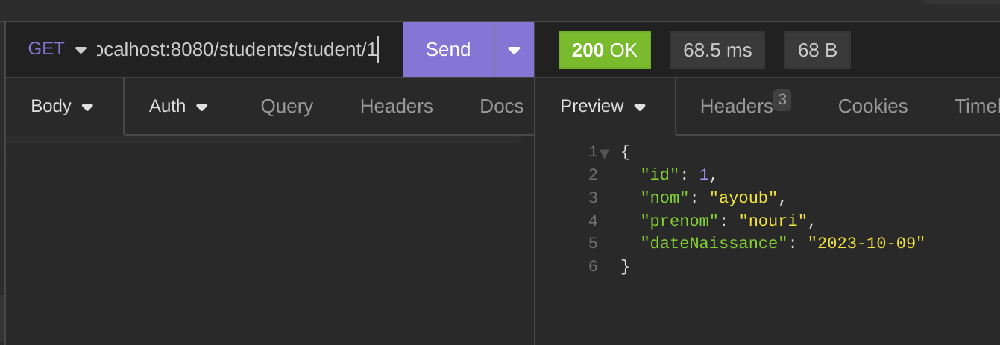

# Spring Boot Rest Web Service

## All endpoints:

### /students/create

### /students/all

### /students/student/delete/{id}

### /students/student/{id}

### /students/count

### /students/student/{id}

